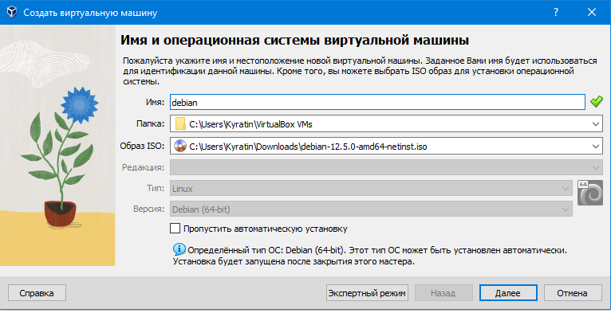
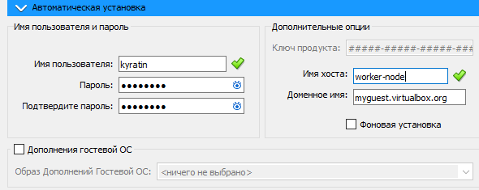
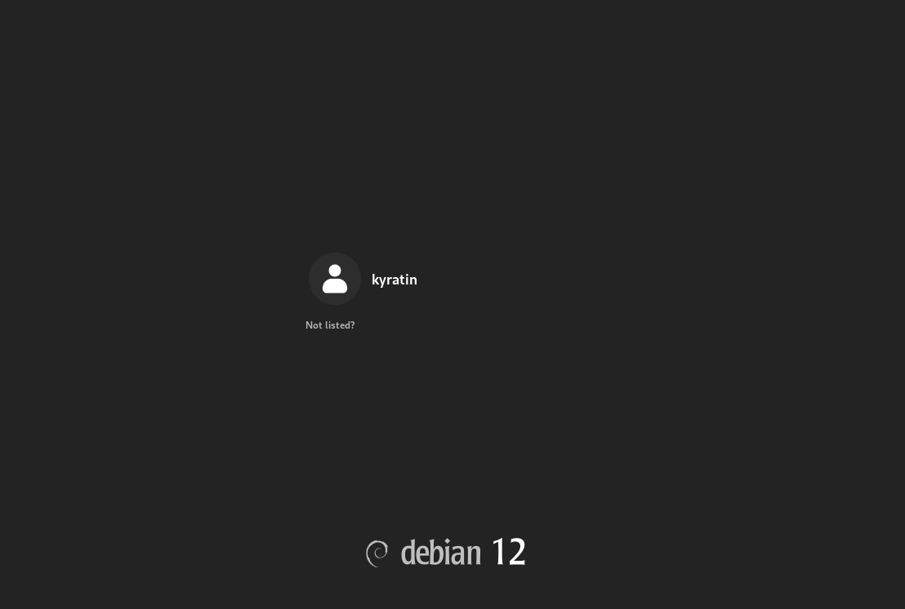
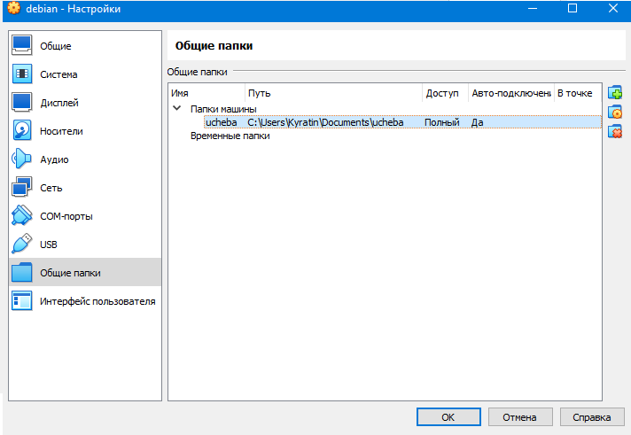

# Цели и задачи работы

## Цель лабораторной работы

Целью данной работы является приобретение практических навыков установки операционной системы на виртуальную машину, настройки минимально необходимых для дальнейшей работы сервисов.

# Ход выполнения

## Создание виртуальной машины

## Создание пользователя в VirtualBox

## Завершение установки и настройка имени хоста

## Добавление общей папки

## Установка гостевых дополнений

## Проверка наличия общей папки в /media

# Выводы по проделанной работе

## Вывод

Мы приобрели практические навыки работы с созданием виртуальной машины.
