# Цели и задачи работы

## Цель лабораторной работы

Ознакомление с файловой системой Linux, её структурой, именами и содержанием каталогов. Приобретение практических навыков по применению команд для работы с файлами и каталогами, по управлению процессами, по проверке использования диска и обслуживанию файловой системы.

## Задачи лабораторной работы

1. Выполнить примеры  
2. Выполнить действия по работе с каталогами и файлами  
3. Выполнить действия с правами доступа  
4. Получить дополнительные сведения при помощи справки по командам  

# Процесс выполнения лабораторной работы

## Выполнение примеров

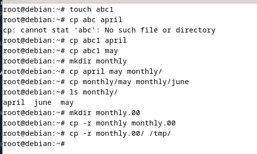{ #fig:001 width=70% }

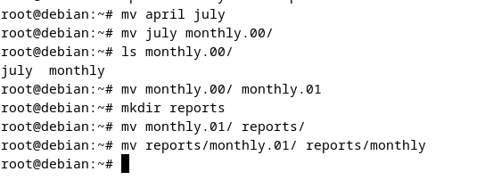{ #fig:002 width=70% }

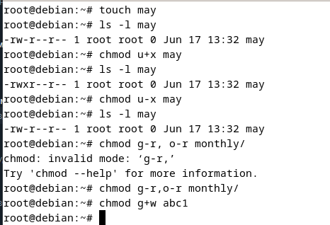{ #fig:003 width=70% }

## Создание директорий и копирование файлов

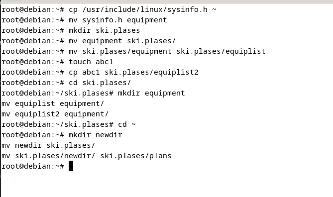{ #fig:004 width=70% }

## Работа с командой chmod

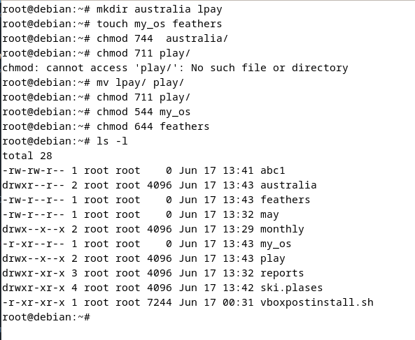{ #fig:005 width=70% }

## Файл /etc/passwd

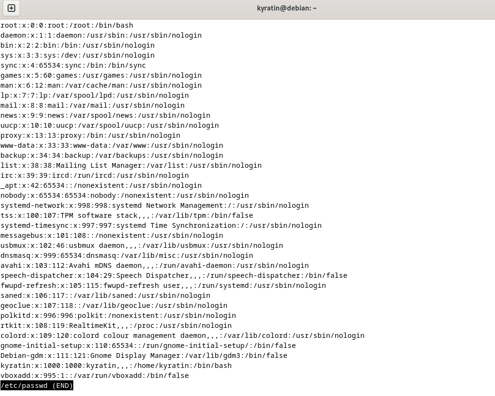{ #fig:006 width=70% }

## Работа с файлами и правами доступа

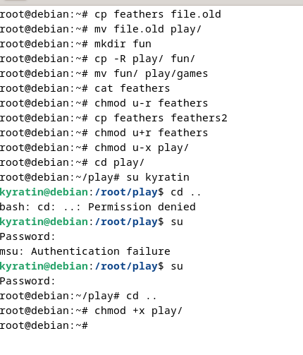{ #fig:007 width=70% }

## Справка по командам

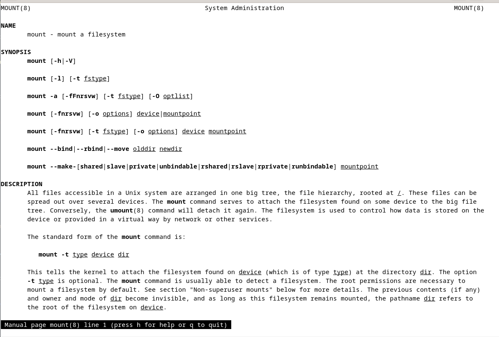{ #fig:008 width=70% }

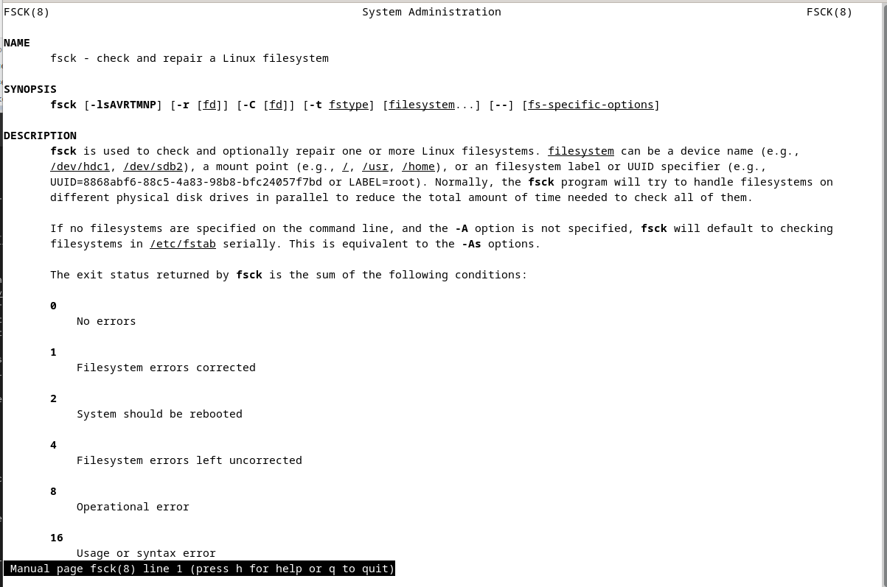{ #fig:009 width=70% }

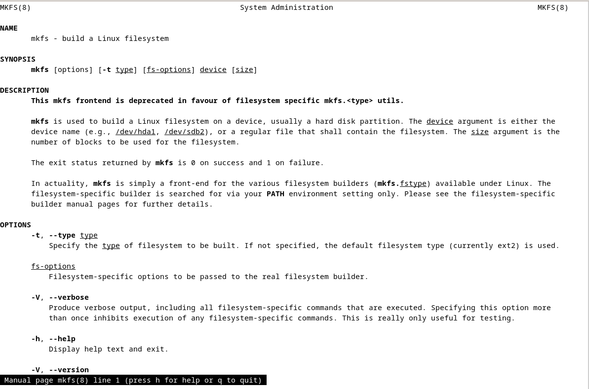{ #fig:010 width=70% }

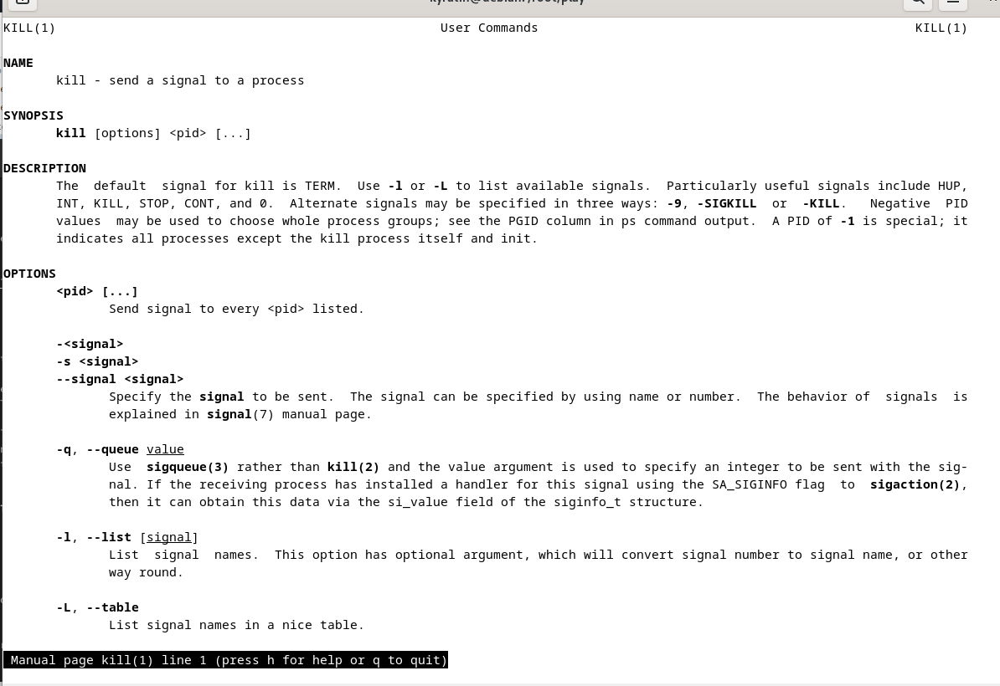{ #fig:011 width=70% }

# Выводы по проделанной работе

## Вывод

В ходе данной работы мы ознакомились с файловой системой Linux, её структурой, именами и содержанием каталогов. Научились выполнять базовые операции с файлами, управлять правами доступа для пользователя и групп, а также получили навыки анализа и обслуживания файловой системы.

