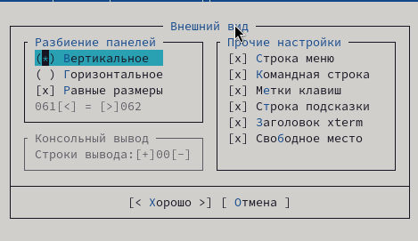
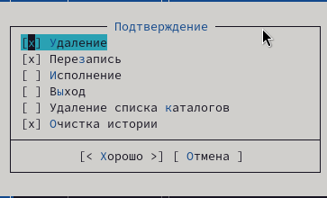

# Цели и задачи работы

## Цель лабораторной работы

Ознакомление с возможностями командной оболочки Midnight Commander и встроенного редактора.

## Задачи лабораторной работы

1. Изучить возможности Midnight Commander  
2. Изучить встроенный редактор Midnight Commander  

# Процесс выполнения лабораторной работы

## Работа с Midnight Commander

{ #fig:001 width=70% height=70% }

{ #fig:002 width=70% height=70% }

{ #fig:003 width=70% height=70% }

{ #fig:004 width=70% height=70% }

{ #fig:005 width=70% height=70% }

{ #fig:006 width=70% height=70% }

{ #fig:007 width=70% height=70% }

{ #fig:008 width=70% height=70% }

{ #fig:009 width=70% height=70% }

{ #fig:010 width=70% height=70% }

{ #fig:011 width=70% height=70% }

{ #fig:012 width=70% height=70% }

{ #fig:013 width=70% height=70% }

{ #fig:014 width=70% height=70% }

{ #fig:015 width=70% height=70% }

{ #fig:016 width=70% height=70% }

{ #fig:017 width=70% height=70% }

{ #fig:018 width=70% height=70% }

{ #fig:019 width=70% height=70% }

{ #fig:020 width=70% height=70% }

{ #fig:021 width=70% height=70% }

{ #fig:022 width=70% height=70% }

{ #fig:023 width=70% height=70% }

{ #fig:024 width=70% height=70% }

{ #fig:025 width=70% height=70% }

## Работа с редактором Midnight Commander

{ #fig:026 width=70% height=70% }

{ #fig:027 width=70% height=70% }

{ #fig:028 width=70% height=70% }

{ #fig:029 width=70% height=70% }

{ #fig:030 width=70% height=70% }

{ #fig:031 width=70% height=70% }

{ #fig:032 width=70% height=70% }

{ #fig:033 width=70% height=70% }

{ #fig:034 width=70% height=70% }

# Выводы по проделанной работе

## Вывод

В данной работе мы ознакомились с возможностями Midnight Commander и его встроенного редактора, научились выполнять базовые файловые операции, редактировать текстовые файлы, настраивать интерфейс и использовать встроенные инструменты командной оболочки.

