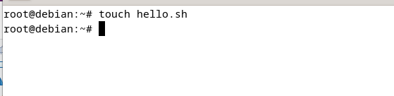
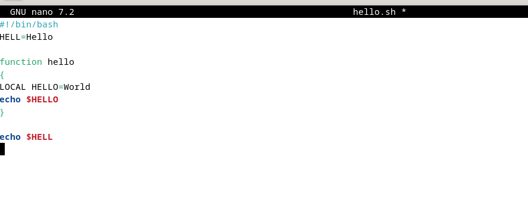
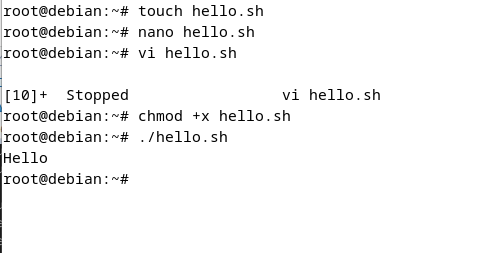
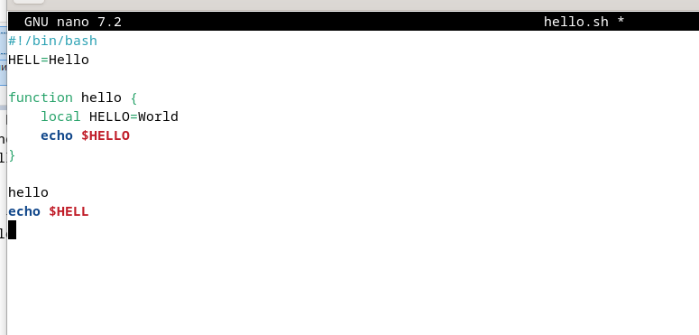
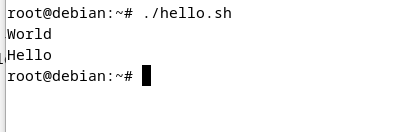

# Цели и задачи работы

## Цель лабораторной работы

Познакомиться с операционной системой Linux. Получить практические навыки работы с редактором `vi`, установленным по умолчанию во многих дистрибутивах.

## Задачи лабораторной работы

1. Изучить возможности редактора `vi`.

# Процесс выполнения лабораторной работы

## Создание каталога

{ #fig:001 width=70% height=70% }

## Работа в редакторе Vi

{ #fig:002 width=70% height=70% }

## Запуск файла

{ #fig:003 width=70% height=70% }

## Повторная работа в редакторе

{ #fig:004 width=70% height=70% }

## Повторный запуск файла

{ #fig:005 width=70% height=70% }

# Выводы по проделанной работе

## Вывод

В ходе работы мы получили практические навыки использования редактора `vi`, освоили основные режимы (нормальный, режим вставки и командный), а также базовые команды для редактирования и сохранения файлов.

