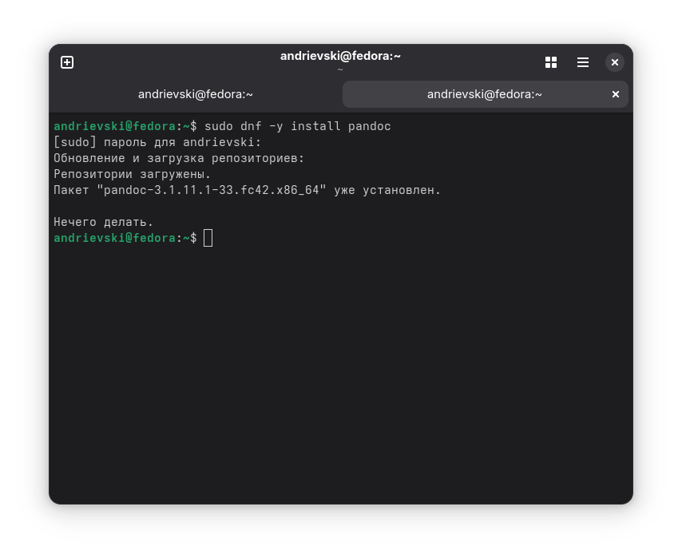
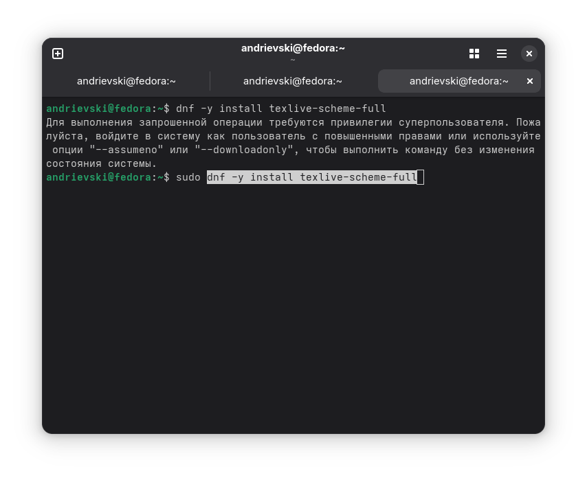
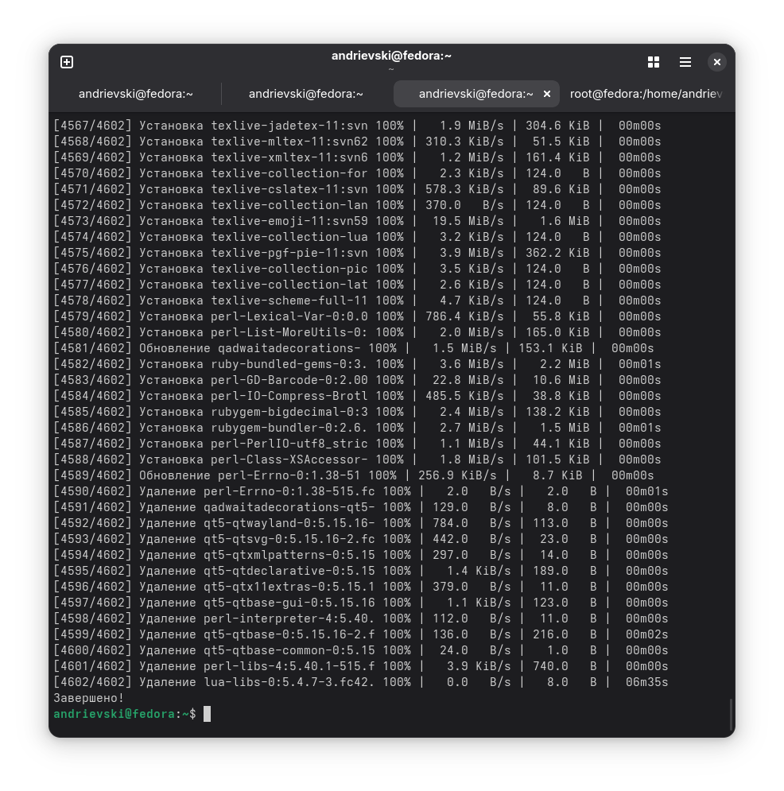
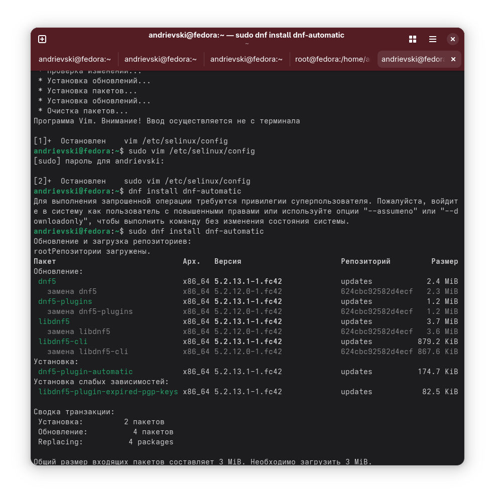

---
## Front matter
title: "Отчёт по лабораторной работе №1"
subtitle: "Установка ОС Linux"
author: "Андриевский Александр"

## Generic otions
lang: ru-RU
toc-title: "Содержание"

## Bibliography
bibliography: bib/cite.bib
csl: pandoc/csl/gost-r-7-0-5-2008-numeric.csl

## Pdf output format
toc: true # Table of contents
toc-depth: 2
lof: true # List of figures
lot: true # List of tables
fontsize: 12pt
linestretch: 1.5
papersize: a4
documentclass: scrreprt
## I18n polyglossia
polyglossia-lang:
  name: russian
  options:
	- spelling=modern
	- babelshorthands=true
polyglossia-otherlangs:
  name: english
## I18n babel
babel-lang: russian
babel-otherlangs: english
## Fonts
mainfont: IBM Plex Serif
romanfont: IBM Plex Serif
sansfont: IBM Plex Sans
monofont: IBM Plex Mono
mathfont: STIX Two Math
mainfontoptions: Ligatures=Common,Ligatures=TeX,Scale=0.94
romanfontoptions: Ligatures=Common,Ligatures=TeX,Scale=0.94
sansfontoptions: Ligatures=Common,Ligatures=TeX,Scale=MatchLowercase,Scale=0.94
monofontoptions: Scale=MatchLowercase,Scale=0.94,FakeStretch=0.9
mathfontoptions:
## Biblatex
biblatex: true
biblio-style: "gost-numeric"
biblatexoptions:
  - parentracker=true
  - backend=biber
  - hyperref=auto
  - language=auto
  - autolang=other*
  - citestyle=gost-numeric
## Pandoc-crossref LaTeX customization
figureTitle: "Рис."
tableTitle: "Таблица"
listingTitle: "Листинг"
lofTitle: "Список иллюстраций"
lotTitle: "Список таблиц"
lolTitle: "Листинги"
## Misc options
indent: true
header-includes:
  - \usepackage{indentfirst}
  - \usepackage{float} # keep figures where there are in the text
  - \floatplacement{figure}{H} # keep figures where there are in the text
---

# Цель работы

Целью данной работы является приобретение практических навыков установки операционной системы на виртуальную машину, настройки минимально необходимых для дальнейшей работы сервисов.

# Задание

    Дождитесь загрузки графического окружения и откройте терминал. В окне терминала проанализируйте последовательность загрузки системы, выполнив команду dmesg. Можно просто просмотреть вывод этой команды:

    dmesg | less

    Можно использовать поиск с помощью grep:

    dmesg | grep -i "то, что ищем"

    Получите следующую информацию.

        Версия ядра Linux (Linux version).

        Частота процессора (Detected Mhz processor).

        Модель процессора (CPU0).

        Объём доступной оперативной памяти (Memory available).

        Тип обнаруженного гипервизора (Hypervisor detected).

        Тип файловой системы корневого раздела.

        Последовательность монтирования файловых систем.

# Теоретическое введение

    При выполнении работ следует придерживаться следующих правил именования:
        Пользователь внутри виртуальной машины должен иметь имя, совпадающее с учётной записью студента, выполняющего лабораторную работу.
        Имя хоста вашей виртуальной машины должно совпадать с учётной записью студента, выполняющего лабораторную работу.
        Имя виртуальной машины должно совпадать с учётной записью студента, выполняющего лабораторную работу.

        В дисплейных классах вы можете посмотреть имя вашей учётной записи, набрав в терминале команду:

        id -un

    

# Выполнение лабораторной работы

После установки. Вошли в ОС под заданной вами при установке учётной записью.Нажали комбинацию Win+Enter для запуска терминала. Переключились на роль супер-пользователя: sudo -i. Обновили все пакеты

{#fig:001 width=70%}

{#fig:002 width=70%}

{#fig:003 width=70%}

{#fig:004 width=70%}

В окне терминала проанализировали последовательность загрузки системы, выполнив команду dmesg. использовали поиск с помощью grep 

    
Получили следующую информацию.

        Версия ядра Linux (Linux version).

        Частота процессора (Detected Mhz processor).

        Модель процессора (CPU0).

        Объём доступной оперативной памяти (Memory available).

        Тип обнаруженного гипервизора (Hypervisor detected).

{#fig:004 width=70%}

{#fig:003 width=70%}

## Контрольные вопросы

### 1. Какую информацию содержит учётная запись пользователя?

Учётная запись пользователя в системе Linux содержит следующие данные:

- **Имя пользователя (login)** — уникальное, используется для входа в систему. Состоит только из латинских символов, цифр и знаков подчёркивания.
- **UID (User ID)** — числовой идентификатор пользователя в системе.
- **GID (Group ID)** — основная группа пользователя.
- **Домашняя директория** — путь к пользовательским файлам, обычно `/home/имя_пользователя`.
- **Оболочка входа (shell)** — программа, запускаемая после входа, например `/bin/bash`.
- **Полное имя (comment field)** — отображается как дополнительная информация (ФИО и т.п.).

Эти данные хранятся в файле `/etc/passwd`.

---

### 2. Укажите команды терминала и приведите примеры:

- Получение справки по команде:  
  `команда --help` или `man команда`  
  Пример: `ls --help`

- Перемещение по файловой системе:  
  `cd каталог`  
  Пример: `cd /home`

- Просмотр содержимого каталога:  
  `ls` или `ls -l`  
  Пример: `ls -la`

- Определение размера каталога:  
  `du -sh каталог`  
  Пример: `du -sh ~/Downloads`

- Создание / удаление каталогов:  
  `mkdir имя`, `rmdir имя`  
  Пример: `mkdir testdir`

- Создание / удаление файлов:  
  `touch имя`, `rm имя`  
  Пример: `touch file.txt`

- Задание прав на файл / каталог:  
  `chmod`, `chown`  
  Пример: `chmod 755 script.sh`

- Просмотр истории команд:  
  `history`

---

### 3. Что такое файловая система? Примеры.

**Файловая система** — способ организации, хранения и управления данными на накопителях. Она определяет структуру каталогов, правила именования файлов и доступ к ним.

Примеры:

- **FAT32** — простая и кроссплатформенная файловая система, поддерживается большинством устройств, но ограничена максимальным размером файла в 4 ГБ.
- **ext4** — основная файловая система в Linux, поддерживает журналирование, большие файлы и каталоги.
- **NTFS** — файловая система Windows, поддерживает права доступа, сжатие, шифрование.

---

### 4. Как посмотреть, какие файловые системы подмонтированы в ОС?

Для этого можно использовать следующие команды:

- `mount` — выведет список всех смонтированных файловых систем.
- `df -hT` — покажет размеры, точки монтирования и типы файловых систем.
- `lsblk -f` — отобразит структуру накопителей и их файловые системы.

---

### 5. Как удалить зависший процесс?

1. Узнать PID процесса:  
 
   ps aux | grep имя_процесса
Завершить процесс:kill PID
Принудительное завершение, если обычный kill не помог:kill -9 PID
Завершить все процессы с конкретным именем:killall имя_процесса

# Выводы

В ходе данной работы приобрел практические навыки установки операционной системы на виртуальную машину, настройки минимально необходимых для дальнейшей работы сервисов.

# Список литературы{.unnumbered}

::: {#refs}
:::\
